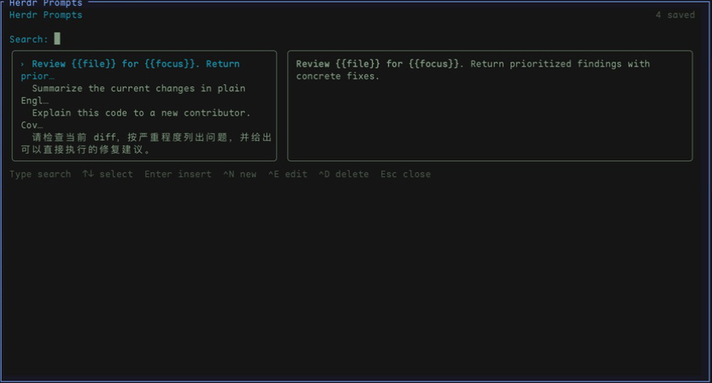
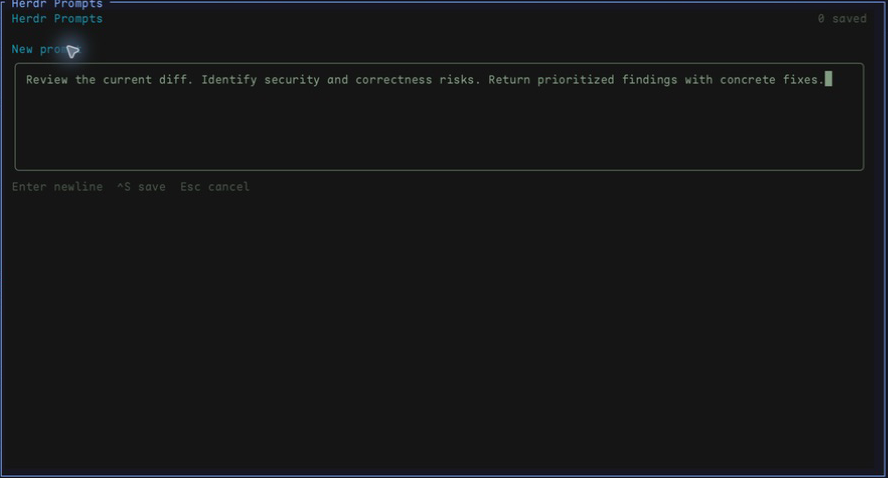
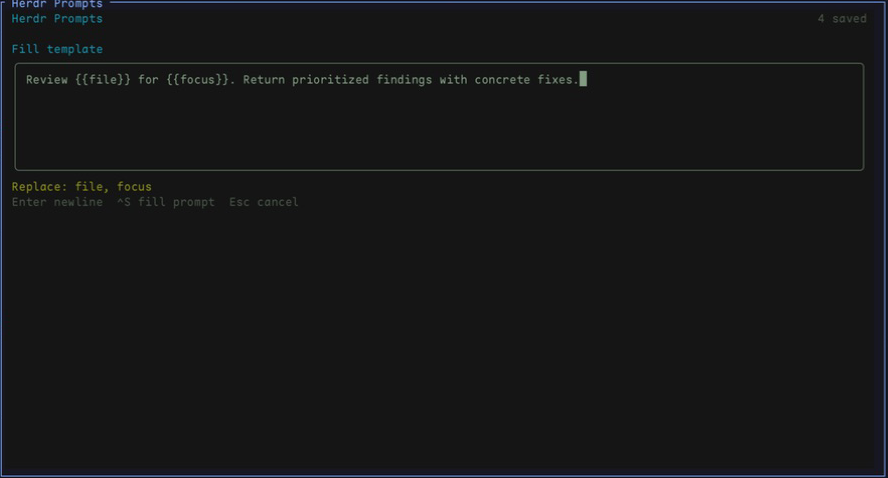

# Herdr Prompts

[English](README.md) | [简体中文](README.zh-CN.md)

**Save once. Find fast. Fill variables. Send to any Agent input.**

Herdr Prompts is a keyboard-first prompt library for [Herdr](https://herdr.dev). It keeps reusable instructions one shortcut away from Codex, Claude Code, OpenCode, and other Agents—then inserts the selected text without submitting it.



## Why Herdr Prompts

- **Build a reusable library.** Create, edit, preview, and delete multiline prompts without leaving Herdr.
- **Find prompts quickly.** Type any part of a prompt to filter the library with case-insensitive substring matching.
- **Turn prompts into templates.** Add `{{variables}}`, fill them for one use, and keep the saved template unchanged.
- **Stay in control.** Insert into the focused Agent input without pressing Enter.
- **Keep everything local.** Prompt data stays on your machine; there are no network requests or telemetry calls.

## See it in action

### Create reusable prompts

Write ordinary text, multiline instructions, Chinese, emoji, or templates. Press `Ctrl+S` to save.



### Fill variables before insertion

Selecting a template opens a one-off editor and shows every unresolved variable. Replace them, press `Ctrl+S`, and the completed prompt is inserted into the original Agent input.



inspired by my friend: bingguanqi

## Requirements

- macOS
- Herdr 0.8.0 or newer
- Node.js 20 or newer

## Install

Install from the Herdr Marketplace, or run:

```bash
herdr plugin install oppenheimor/herdr-prompts
```

### Open the picker

Herdr 0.8 does not display plugin actions in the pane context menu. To give the picker a keyboard entrypoint without claiming a potentially conflicting shortcut, choose an unbound key and add it to `~/.config/herdr/config.toml`. The key below is only an example—change it if it conflicts with your setup.

```toml
[[keys.command]]
key = "prefix+u"
type = "plugin_action"
command = "oppenheimor.herdr-prompts.open"
description = "Open prompt picker"
```

Reload the configuration after editing it:

```bash
herdr server reload-config
```

Focus the destination Agent pane, then press your configured shortcut. With Herdr's default prefix, the example above means `Ctrl+B`, followed by `u`.

You can also invoke the installed action from a Herdr-managed terminal after focusing the destination Agent pane:

```bash
herdr plugin action invoke open --plugin oppenheimor.herdr-prompts
```

## Use

The picker opens over the focused Agent pane. Selecting a normal prompt inserts its text into that same Agent's input without pressing Enter.

### Prompt list

| Key | Action |
| --- | --- |
| Type | Search prompt contents |
| `↑` / `↓` | Change selection |
| `Enter` | Insert the selected prompt |
| `Ctrl+N` | Create a prompt |
| `Ctrl+E` | Edit the selected prompt |
| `Ctrl+D` | Delete the selected prompt, with confirmation |
| `Esc` | Close the picker |

### Create, edit, or fill

| Key | Action |
| --- | --- |
| `Enter` | Insert a newline |
| `Ctrl+S` | Save, or insert a filled template |
| Arrow keys | Move the cursor |
| `Esc` | Cancel |

Prompt content supports full UTF-8 text, including multiline Chinese and emoji.

## Templates

Use `{{variable}}` anywhere in a prompt:

```text
Review {{file}} for {{concern}} and answer in {{language}}.
```

When you select a prompt with variables, Herdr Prompts opens a one-off full-text editor. Replace every unresolved variable and press `Ctrl+S`; the filled text is inserted into the original Agent input, while the saved template remains unchanged.

Variable names may contain letters, numbers, underscores, and Chinese characters. Escape a literal opening delimiter with `\{{`, for example `\{{not_a_variable}}`; the inserted result contains `{{not_a_variable}}`.

## Storage and privacy

Prompts are stored in `prompts.json` under the plugin's private configuration directory. Print that directory with:

```bash
herdr plugin config-dir oppenheimor.herdr-prompts
```

The versioned format is intentionally small and ready for future metadata:

```json
{
  "version": 1,
  "prompts": [
    { "content": "Review the current diff." }
  ]
}
```

Writes are atomic and the file is created with mode `0600`. Invalid or unsupported stores are reported and never overwritten. Exact duplicate prompts and blank prompts are rejected. Concurrent editing from multiple picker sessions is not supported in this release.

Before inserting, the plugin verifies that the original pane still hosts an Agent in the `idle` or `done` state. It never sends Enter.

## Development

```bash
pnpm install
pnpm check
pnpm plugin:link
```

The committed `dist/index.mjs` is the self-contained Node.js bundle used by the root `herdr-plugin.toml` manifest.

## License

[MIT](LICENSE)
